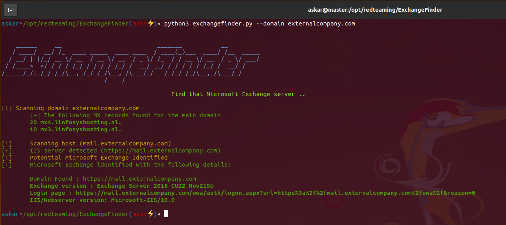
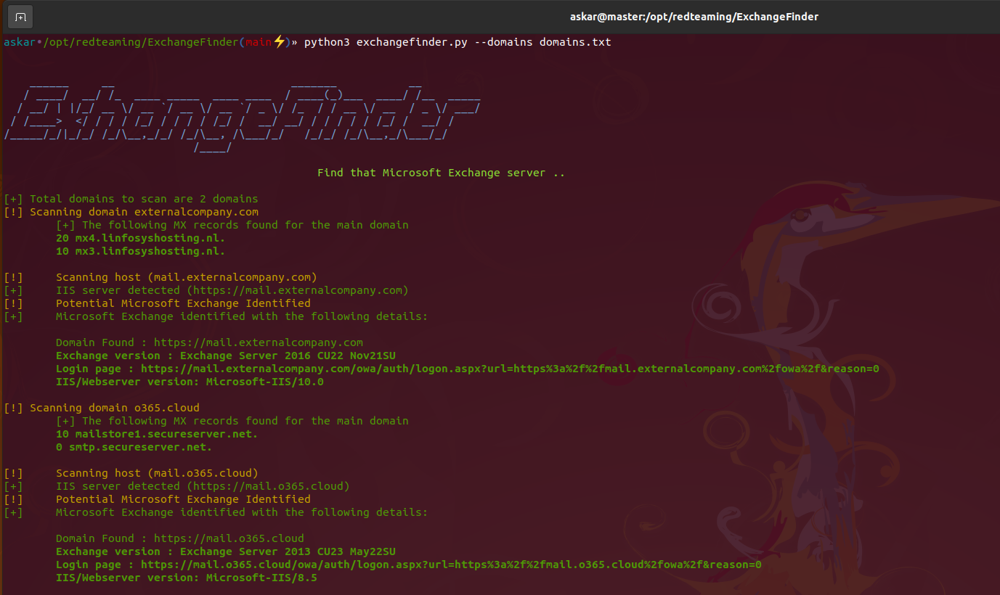

# ExchangeFinder 

ExchangeFinder is a simple and open-source tool that tries to find Micrsoft Exchange instance for a given domain based on the top common DNS names for Microsoft Exchange.

ExchangeFinder can identify the exact version of Microsoft Exchange starting from `Microsoft Exchange 4.0` to `Microsoft Exchange Server 2019`.

# How does it work?

ExchangeFinder will first try to resolve any subdomain that is commonly used for Exchange server, then it will send a couple of HTTP requests to parse the content of the response sent by the server to identify if it's using Microsoft Exchange or not.

Currently, the tool has a signature of every version from Microsoft Exchange starting from `Microsoft Exchange 4.0` to `Microsoft Exchange Server 2019`, and based on the build version sent by Exchange via the header `X-OWA-Version` we can identify the exact version.

If the tool found a valid Microsoft Exchange instance, it will return the following results:

* Domain name.
* Microsoft Exchange version.
* Login page.
* Web server version. 

# Installation & Requirements

Clone the latest version of `ExchangeFinder` using the following command:

`git clone https://github.com/mhaskar/ExchangeFinder`

And then install all the requirements using the command `poetry install`.

```
┌──(kali㉿kali)-[~/Desktop/ExchangeFinder]
└─$ poetry install                                                                                                                   1 ⨯
Installing dependencies from lock file


Package operations: 15 installs, 0 updates, 0 removals

  • Installing pyparsing (3.0.9)
  • Installing attrs (22.1.0)
  • Installing certifi (2022.6.15)
  • Installing charset-normalizer (2.1.1)
  • Installing idna (3.3)
  • Installing more-itertools (8.14.0)
  • Installing packaging (21.3)
  • Installing pluggy (0.13.1)
  • Installing py (1.11.0)
  • Installing urllib3 (1.26.12)
  • Installing wcwidth (0.2.5)
  • Installing dnspython (2.2.1)
  • Installing pytest (5.4.3)
  • Installing requests (2.28.1)
  • Installing termcolor (1.1.0)

Installing the current project: ExchangeFinder (0.1.0)
                                                                                                                                         
┌──(kali㉿kali)-[~/Desktop/ExchangeFinder]

```

```
┌──(kali㉿kali)-[~/Desktop/ExchangeFinder]
└─$ python3 exchangefinder.py 

    
    ______     __                           _______           __         
   / ____/  __/ /_  ____ _____  ____ ____  / ____(_)___  ____/ /__  _____
  / __/ | |/_/ __ \/ __ `/ __ \/ __ `/ _ \/ /_  / / __ \/ __  / _ \/ ___/
 / /____>  </ / / / /_/ / / / / /_/ /  __/ __/ / / / / / /_/ /  __/ /    
/_____/_/|_/_/ /_/\__,_/_/ /_/\__, /\___/_/   /_/_/ /_/\__,_/\___/_/     
                             /____/                                        
                                                
                                                Find that Microsoft Exchange server ..
    
[-] Please use --domain or --domains option
                                                                                                                                         
┌──(kali㉿kali)-[~/Desktop/ExchangeFinder]
└─$ 
                                                                              
```

# Usage

You can use the option `-h` to show the help banner:

```
askar•/opt/redteaming/ExchangeFinder(main⚡)» python3 exchangefinder.py -h                                                                                                          

    
    ______     __                           _______           __         
   / ____/  __/ /_  ____ _____  ____ ____  / ____(_)___  ____/ /__  _____
  / __/ | |/_/ __ \/ __ `/ __ \/ __ `/ _ \/ /_  / / __ \/ __  / _ \/ ___/
 / /____>  </ / / / /_/ / / / / /_/ /  __/ __/ / / / / / /_/ /  __/ /    
/_____/_/|_/_/ /_/\__,_/_/ /_/\__, /\___/_/   /_/_/ /_/\__,_/\___/_/     
                             /____/                                        
                                                
                                                Find that Microsoft Exchange server ..
    
usage: exchangefinder.py [-h] [--domain DOMAIN] [--domains DOMAINS] [--useragent USERAGENT] [--output OUTPUT] [--verbose]

DNSStager main parser

optional arguments:
  -h, --help            show this help message and exit
  --domain DOMAIN       The target domain you want to scan (example.com)
  --domains DOMAINS     Path to domains file you want to scan (domains.txt)
  --useragent USERAGENT
                        Useragent to use, the default is "Mozilla/5.0 (Windows NT 10.0; Win64; x64) AppleWebKit/537.36 (KHTML, like Gecko) Chrome/104.0.0.0 Safari/537.36."
  --output OUTPUT       Export results to given .csv file
  --verbose             Show detailed output
askar•/opt/redteaming/ExchangeFinder(main⚡)»                                                                                                                                       

```
### Scan single domain
To scan single domain you can use the option `--domain` like the following:

```
askar•/opt/redteaming/ExchangeFinder(main⚡)» python3 exchangefinder.py --domain dummyexchangetarget.com                                                                                           

    
    ______     __                           _______           __         
   / ____/  __/ /_  ____ _____  ____ ____  / ____(_)___  ____/ /__  _____
  / __/ | |/_/ __ \/ __ `/ __ \/ __ `/ _ \/ /_  / / __ \/ __  / _ \/ ___/
 / /____>  </ / / / /_/ / / / / /_/ /  __/ __/ / / / / / /_/ /  __/ /    
/_____/_/|_/_/ /_/\__,_/_/ /_/\__, /\___/_/   /_/_/ /_/\__,_/\___/_/     
                             /____/                                        
                                                
                                                Find that Microsoft Exchange server ..
    
[!] Scanning domain dummyexchangetarget.com
	[+] The following MX records found for the main domain
	10 mx01.dummyexchangetarget.com.

[!] 	Scanning host (mail.dummyexchangetarget.com)
[+] 	IIS server detected (https://mail.dummyexchangetarget.com)
[!] 	Potential Microsoft Exchange Identified
[+] 	Microsoft Exchange identified with the following details:

	Domain Found : https://mail.dummyexchangetarget.com
	Exchange version : Exchange Server 2016 CU22 Nov21SU
	Login page : https://mail.dummyexchangetarget.com/owa/auth/logon.aspx?url=https%3a%2f%2fmail.dummyexchangetarget.com%2fowa%2f&reason=0
	IIS/Webserver version: Microsoft-IIS/10.0

[!] 	Scanning host (autodiscover.dummyexchangetarget.com)
[+] 	IIS server detected (https://autodiscover.dummyexchangetarget.com)
[!] 	Potential Microsoft Exchange Identified
[+] 	Microsoft Exchange identified with the following details:

	Domain Found : https://autodiscover.dummyexchangetarget.com
	Exchange version : Exchange Server 2016 CU22 Nov21SU
	Login page : https://autodiscover.dummyexchangetarget.com/owa/auth/logon.aspx?url=https%3a%2f%2fautodiscover.dummyexchangetarget.com%2fowa%2f&reason=0
	IIS/Webserver version: Microsoft-IIS/10.0

askar•/opt/redteaming/ExchangeFinder(main⚡)»                                                                                                                                       

```




### Scan multiple domains
To scan multiple domains (targets) you can use the option `--domains` and choose a file like the following:

```
askar•/opt/redteaming/ExchangeFinder(main⚡)» python3 exchangefinder.py --domains domains.txt                                                                                                          [22:02:11]

    
    ______     __                           _______           __         
   / ____/  __/ /_  ____ _____  ____ ____  / ____(_)___  ____/ /__  _____
  / __/ | |/_/ __ \/ __ `/ __ \/ __ `/ _ \/ /_  / / __ \/ __  / _ \/ ___/
 / /____>  </ / / / /_/ / / / / /_/ /  __/ __/ / / / / / /_/ /  __/ /    
/_____/_/|_/_/ /_/\__,_/_/ /_/\__, /\___/_/   /_/_/ /_/\__,_/\___/_/     
                             /____/                                        
                                                
                                                Find that Microsoft Exchange server ..
    
[+] Total domains to scan are 2 domains
[!] Scanning domain externalcompany.com
	[+] The following MX records found for the main domain
	20 mx4.linfosyshosting.nl.
	10 mx3.linfosyshosting.nl.

[!] 	Scanning host (mail.externalcompany.com)
[+] 	IIS server detected (https://mail.externalcompany.com)
[!] 	Potential Microsoft Exchange Identified
[+] 	Microsoft Exchange identified with the following details:

	Domain Found : https://mail.externalcompany.com
	Exchange version : Exchange Server 2016 CU22 Nov21SU
	Login page : https://mail.externalcompany.com/owa/auth/logon.aspx?url=https%3a%2f%2fmail.externalcompany.com%2fowa%2f&reason=0
	IIS/Webserver version: Microsoft-IIS/10.0

[!] Scanning domain o365.cloud
	[+] The following MX records found for the main domain
	10 mailstore1.secureserver.net.
	0 smtp.secureserver.net.

[!] 	Scanning host (mail.o365.cloud)
[+] 	IIS server detected (https://mail.o365.cloud)
[!] 	Potential Microsoft Exchange Identified
[+] 	Microsoft Exchange identified with the following details:

	Domain Found : https://mail.o365.cloud
	Exchange version : Exchange Server 2013 CU23 May22SU
	Login page : https://mail.o365.cloud/owa/auth/logon.aspx?url=https%3a%2f%2fmail.o365.cloud%2fowa%2f&reason=0
	IIS/Webserver version: Microsoft-IIS/8.5

askar•/opt/redteaming/ExchangeFinder(main⚡)»                                                                                                                                                          [22:02:33]

```



